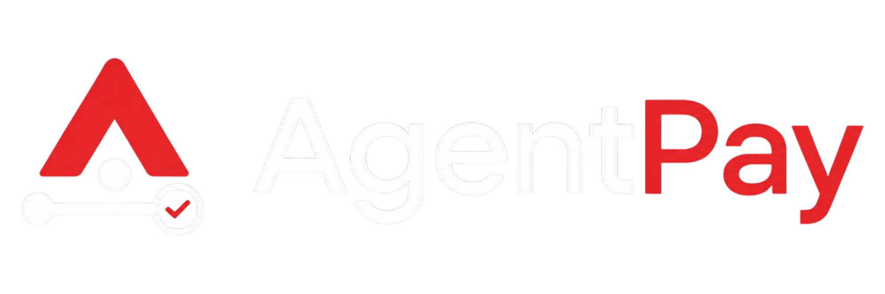
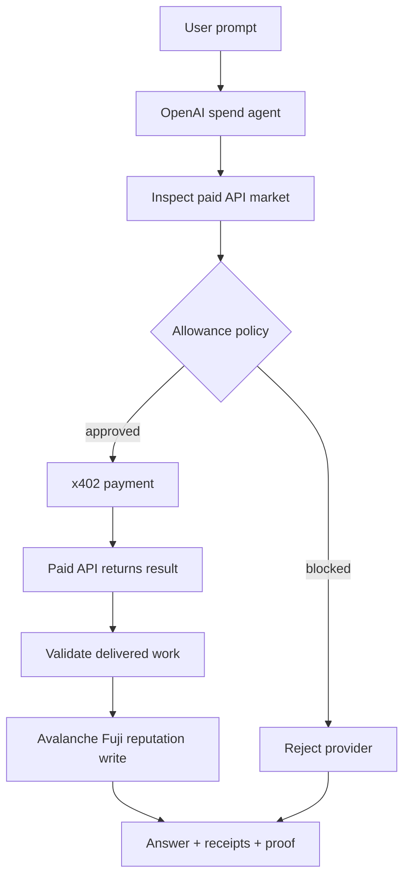
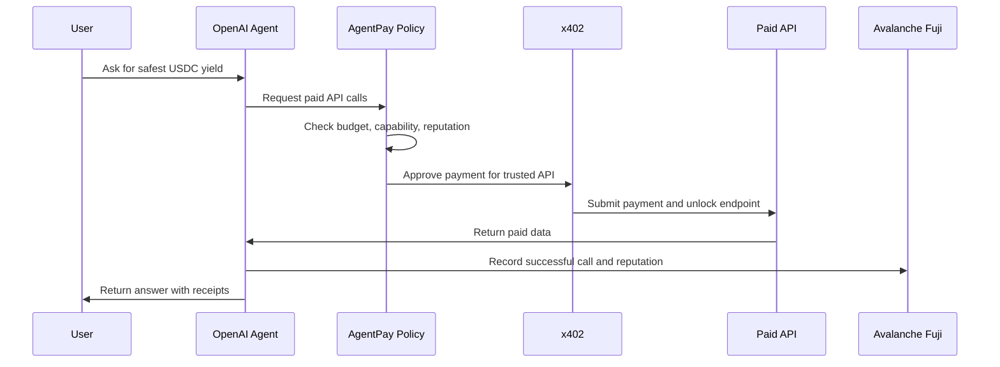
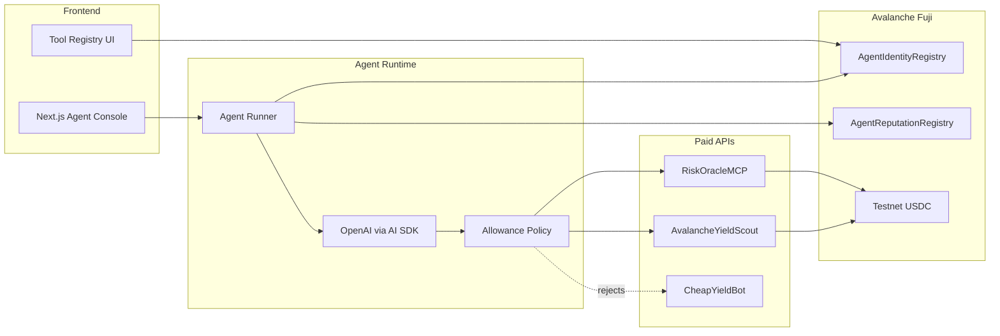

<picture>
  <source media="(prefers-color-scheme: dark)" srcset="public/branding_dark.png">
  
</picture>

# AgentPay

AgentPay lets AI agents safely buy paid APIs with spending limits. OpenAI chooses the tools, policy checks approve spend, x402 handles payment, and Avalanche Fuji records receipts and reputation proof.

## Hackathon Deliverables

- **Working prototype:** Next.js app deployed on Vercel.
- **Network:** Avalanche Fuji Testnet, the Avalanche C-Chain testnet.
- **Agent demo:** An OpenAI-powered agent chooses paid APIs, pays through x402, receives API results, and writes reputation proof on Fuji.
- **Contracts:** Agent identity and reputation registries deployed to Fuji.
- **No real funds:** Uses Fuji test AVAX and testnet USDC-compatible payment configuration.
- **Submission delta:** This Speedrun adds the model-driven spend agent, allowance policy, x402 paid tool calls, onchain reputation writes, proof UI, and production deployment.

Production demo:

```text
https://agentpay-mcp.vercel.app
```

Health check:

```text
https://agentpay-mcp.vercel.app/api/health/config
```

## Problem

AI agents need live data and specialized APIs, but payments are unsafe without limits.

Today, an agent either cannot pay for tools at all, or it needs broad wallet access. That creates obvious problems:

- The agent can overspend.
- The agent may pay low-quality providers.
- The user cannot easily see what was bought.
- API providers do not get a clean way to sell agent-accessible endpoints.
- There is no shared trust trail after a paid call succeeds.

## Solution

AgentPay gives an AI agent a small allowance and strict spend rules.

The agent can inspect paid APIs, decide which ones are useful, and request payment. Before any payment happens, AgentPay checks:

- max budget
- max number of APIs
- allowed API capabilities
- minimum provider reputation

If the request passes, x402 pays the API on Avalanche Fuji. After the API returns useful work, AgentPay writes reputation proof onchain.

## What The Demo Shows

Prompt:

```text
Find the safest Avalanche yield opportunity for 1,000 USDC
```

End-to-end result:

1. OpenAI reasons over the task.
2. The agent inspects registered paid APIs.
3. It selects the trusted yield API and risk API.
4. It rejects the cheap low-reputation provider.
5. x402 pays the selected APIs on Fuji.
6. The APIs return yield and risk data.
7. AgentPay records successful calls and reputation feedback on Fuji.
8. The UI shows the answer, spend, x402 receipts, rejected providers, and reputation tx hashes.

## High-Level Flow



## Payment Flow



## Architecture



## How AgentPay Uses x402

AgentPay uses x402 as the payment layer for paid API access.

Each paid API route is protected with x402:

- `POST /api/tools/yield-scout`
- `POST /api/tools/risk-oracle`
- `POST /api/tools/cheap-yield-bot`

When the agent calls a paid API:

1. The API returns HTTP 402 payment requirements.
2. `@x402/fetch` prepares and submits payment from the buyer wallet.
3. The x402 facilitator verifies settlement.
4. The API unlocks and returns data.
5. AgentPay displays the payment receipt in the UI.

The important part: the OpenAI model can request payment, but x402 payment only happens after deterministic policy checks pass.

## How AgentPay Uses ERC-8004-Style Identity And Trust

AgentPay models paid APIs as registered agent/tool providers.

The deployed registries are:

- `AgentIdentityRegistry`
- `AgentReputationRegistry`

The identity registry stores provider metadata:

- agent ID
- API URI
- endpoint
- wallet
- price
- capabilities
- x402 support

The reputation registry stores trust data:

- successful paid calls
- failed calls
- ratings
- feedback tags
- feedback hashes

After a paid API returns valid work, AgentPay writes:

- `recordSuccessfulCall(agentId, paymentRef)`
- `giveFeedback(agentId, 5, ..., "paid-call", "x402-autonomous-agent", ...)`

This gives the next agent run an onchain trust signal before spending.

## Tech Used

- **Frontend:** Next.js App Router, React, CSS
- **AI:** OpenAI + Vercel AI SDK
- **Payments:** x402, `@x402/fetch`, `@x402/next`, `@x402/evm`
- **Blockchain:** Avalanche Fuji C-Chain
- **Contracts:** Solidity, Hardhat
- **Wallet / chain SDK:** ethers, viem
- **Markdown rendering:** Streamdown
- **Deployment:** Vercel

## Core Routes

### Product UI

- `/` — landing page
- `/agent` — live agent console
- `/registry` — registered paid API providers
- `/developer` — developer integration notes

### API

- `GET /api/health/config` — checks production readiness
- `GET /api/agents` — list registered paid API providers
- `GET /api/agents/:id` — provider metadata
- `GET /api/agents/search?capability=...` — capability search
- `POST /api/run-agent` — OpenAI spend agent flow
- `POST /api/tools/yield-scout` — x402-protected paid API
- `POST /api/tools/risk-oracle` — x402-protected paid API
- `POST /api/tools/cheap-yield-bot` — x402-protected paid API
- `POST /api/feedback` — manual reputation write endpoint

## Speedrun Delta

Built before this challenge:

- Basic paid MCP-style tool registry
- Initial agent runner and Next.js shell
- Solidity identity and reputation registry contracts

Added for this Speedrun:

- OpenAI model-driven agent loop
- AI tool calls for market inspection and paid API requests
- Allowance policy for budget, capability, reputation, and max tools
- Real x402 paid API calls on Avalanche Fuji
- Autonomous reputation writes after validated paid API responses
- Inline proof UI with x402 receipts, decision traces, and tx hashes
- Markdown-rendered agent answers
- Polished landing, registry, developer, and agent console pages
- Vercel production deployment

## Local Setup

```bash
pnpm install
cp .env.example .env.local
```

Fill every required value in `.env.local`.

```bash
pnpm dev
```

## Required Environment

```env
NEXT_PUBLIC_APP_URL=http://localhost:3000
AVALANCHE_FUJI_RPC=https://api.avax-test.network/ext/bc/C/rpc

OPENAI_API_KEY=sk-...
OPENAI_MODEL=gpt-4.1

X402_FACILITATOR_URL=https://...
USDC_ADDRESS=0x...

BUYER_PRIVATE_KEY=0x...
CHEAPYIELDBOT_WALLET=0x...
AVALANCHEYIELDSCOUT_WALLET=0x...
RISKORACLEMCP_WALLET=0x...

DEPLOYER_PRIVATE_KEY=0x...
FEEDBACK_PRIVATE_KEY=0x...
IDENTITY_REGISTRY_ADDRESS=0x...
REPUTATION_REGISTRY_ADDRESS=0x...
```

## Deploy Contracts

```bash
pnpm compile:contracts
pnpm deploy:contracts
```

The deploy script:

- deploys identity and reputation registries
- registers the three paid API providers
- writes initial reputation so the demo can reject a low-trust provider

## Demo Readiness

```bash
pnpm demo:status
curl http://localhost:3000/api/health/config
```

Production health:

```bash
curl https://agentpay-mcp.vercel.app/api/health/config
```

Expected result:

```json
{
  "ok": true,
  "network": "eip155:43113"
}
```

## Run The Agent From CLI

```bash
curl -X POST http://localhost:3000/api/run-agent \
  -H "content-type: application/json" \
  -d '{
    "task": "Find the safest Avalanche yield opportunity for 1,000 USDC",
    "maxBudgetAtomic": 100000,
    "minReputation": 4,
    "allowedCapabilities": [
      "avalanche-defi-yield-search",
      "defi-risk-scoring"
    ],
    "maxTools": 2
  }'
```

## Demo Video Script

1. Open the landing page.
   - "AgentPay lets AI agents safely buy paid APIs. The user sets a budget and rules first."

2. Open `/agent`.
   - "This agent has a small USDC allowance on Avalanche Fuji. It can only buy APIs that match the policy."

3. Run:

```text
Find the safest Avalanche yield opportunity for 1,000 USDC
```

4. While it runs:
   - "OpenAI decides which APIs are useful. AgentPay checks budget, capability, and reputation before any payment."

5. Show the answer:
   - "The agent paid the yield and risk APIs through x402, rejected the low-reputation provider, and returned a recommendation."

6. Show proof:
   - "The response includes x402 receipts, selected and rejected tools, total spend, and reputation transaction hashes on Fuji."

7. Close:
   - "This is the full loop: agent chooses, pays, gets paid data, and writes onchain trust proof."

## Why It May Fail Locally

This project intentionally has no fake settlement fallback.

The paid flow needs:

- Fuji RPC
- OpenAI API key
- x402 facilitator supporting `eip155:43113`
- funded buyer wallet
- valid testnet USDC/payment asset
- deployed identity and reputation registries
- funded feedback wallet for reputation writes

If any of these are missing, the app returns a configuration or payment error instead of fabricating a transaction.
